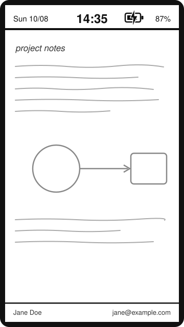
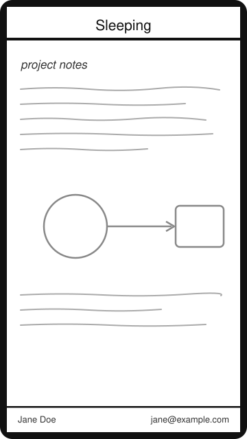
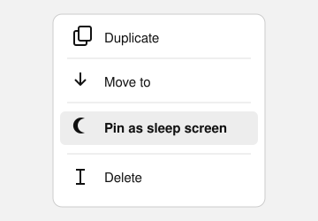

# pinnedPageSleepScreen

A [xovi](https://github.com/asivery/rmpp-xovi-extensions) mod for the
reMarkable Paper Pro Move: pin any document page — or keep the live screen —
as your sleep screen, with an optional clock/date/battery bar that stays
fresh even in deep sleep.

Built and tested on the **Paper Pro Move, OS 3.27.x**.

| With the clock companion | Main package alone |
| :---: | :---: |
|  |  |

*(schematic mockups, not device screenshots — the real thing shows your
actual page at full e-ink quality)*

## What it does

### Pin a page



Open any document, open the page menu (Pages foldout) and tap
**Pin as sleep screen**. From then on, pressing the power button shows that
page as the sleep image — captured clean, without toolbars or menus, in the
exact zoom/position you pinned it. Re-pin any time to update; unpin from
the same menu to go back to stock sleep screens. Pinned images survive
reboots.

### Live screen ("Visible content")

Turn on the native **Settings → Display → Visible content** toggle and the
mod keeps whatever was on screen when the device fell asleep — captured in
~70 ms at the moment sleep starts, in the correct orientation. If both are
active: the **power button** shows your *pinned page*, an **idle timeout**
keeps the *live screen*.

With a passcode set, the PIN pad is never captured — a locked device shows
the last unlocked screen instead, or falls back to stock.

### Neither

No pin and toggle off? You keep the stock sleep screens; the bar still
draws on top.

### The bar

A full-width bar at the top of every sleep screen. What's in it depends on
which packages you installed:

- **Main package only**: a static "Sleeping" label. Nothing updates, no
  timers run, zero battery impact.
- **With `pinned-sleep-clock`**: weekday + date on the left, a bold clock
  in the center, battery % with a charging bolt on the right. In deep
  sleep the clock updates every 5 minutes, exactly on :00/:05/:10…
  wall-clock marks. **This costs battery — read
  [the companion section](#the-companion-pinned-sleep-clock-what-it-touches-and-what-it-costs) before installing.**

If you filled in the OS *"If found…"* contact info, a thin bar at the
bottom shows your name and contact on every sleep screen too.

### When something goes wrong

Missing sleep images (e.g. first sleep after a reboot) fall back to stock
screens silently. A corrupt image shows a friendly "couldn't load the sleep
image" page with a link to the issue tracker — the mod never leaves you
with a black screen.

## Install

You need [xovi](https://github.com/asivery/rmpp-xovi-extensions) and
[vellum](https://github.com/vellum-dev/vellum) set up. Then:

```
vellum add pinned-page-sleep-screen        # the mod (static bar)
vellum add pinned-sleep-clock              # optional: live clock/battery bar
```

Installing the companion **is** the clock's opt-in — there is no Settings
toggle. Remove it with `vellum del pinned-sleep-clock` and the bar goes
static again; `vellum del pinned-page-sleep-screen` removes everything.

### Setup tip: 24-hour clock and date order

The bar follows the device locale, and the stock UI has **no way to change
it** (factory setting is `en_US` — 12-hour clock, MM/DD dates). Over SSH,
with the `mount-utils` vellum package installed:

```
mount-rw
echo 'LANG=en_GB.UTF-8' > /etc/locale.conf
mount-restore
```

then reboot (re-run your usual xovi start afterwards — e.g. triple-tap).
`en_GB` gives a 24-hour clock and dd/MM dates; any glibc-style locale name
works. Survives reboots; an OS update resets it.

### Setup tip: timezone (the bar clock shows UTC otherwise)

The stock UI has no timezone setting either — the device runs UTC and the
stock interface simply never shows you a clock. The bar does, so set your
zone in the same `mount-rw` window as the locale:

```
mount-rw
timedatectl set-timezone Europe/London
mount-restore
```

Any `Region/City` name from `timedatectl list-timezones` works. Inside the
`mount-rw` window the change lands on the real rootfs and **survives
reboots** (an OS update resets it, like everything else). A plain
`timedatectl set-timezone` without that window also works immediately —
but silently reverts to UTC on the next reboot, because `/etc` on this OS
is a RAM-backed overlay.

**Don't hand-shift the clock instead** (`date -s` to fake local time):
the OS runs chrony against Google NTP with `rtcsync`, so the first
successful sync after any reboot steps the clock straight back to true
UTC and keeps rewriting the hardware clock with it. The system clock
belongs to NTP; the timezone is yours.

## The companion (pinned-sleep-clock): what it touches and what it costs

The companion is a **sister package, not a standalone mod** — it hard-depends
on `pinned-page-sleep-screen` (vellum won't install it alone) and does
nothing but power the main mod's live bar.

**Battery caution.** A sleeping tablet that repaints a clock must wake the
SoC — there is no way around that on this hardware. The cadence is yours:
**Settings → Display → Sleep clock** is a toggle (same pattern as
Battery → Standby); switched on it offers 1 / 5 / 15 minutes. Switched
off, the bar keeps the date and battery (refreshed whenever the device
wakes anyway) with no clock wakes at all. Each update wakes the device
for roughly half a minute:

| Sleep clock setting | Standing drain (measured, OS 3.27.3) |
| ------------- | ----- |
| Off | ~0.16 %/h |
| 5 minutes (default) | **~0.9 %/h (~22 %/day)** |
| 15 minutes | ~0.42 %/h |

It also currently prevents the OS's suspend-then-hibernate from ever
reaching its 4 h deadline, so a long-idle device keeps the higher
suspend-to-RAM drain instead of dropping to near-zero hibernation. An
idle-gating fix is designed ([docs/plan-d-design.md](docs/plan-d-design.md)).
If you routinely leave the device unplugged for days, skip the companion
or widen the cadence.

**Everything it changes on your system** (all applied by lifecycle
scripts, all reverted by `vellum del pinned-sleep-clock`):

- `/etc/systemd/system/pinsleep-clock.{service,timer}` — the `WakeSystem`
  timer that thaws the device so the bar's (frozen) QML timer can repaint;
  its cadence follows the Sleep clock setting (written as a timer drop-in,
  re-asserted on every xochitl start). The service is `/bin/true`: the
  wake itself is the payload.
  Written to the persistent rootfs `/etc` (the `/etc` overlay upper is
  tmpfs and forgets everything on reboot); the enable symlink is volatile,
  so the main mod re-asserts enablement on every xochitl start.
- `/usr/lib/systemd/system-sleep/sleep-zz-pinsleep.sh` — new hook: shrinks
  the EPD PMIC rail keep-alive during battery sleep so re-suspends never
  abort (details below).
- `/usr/lib/systemd/system-sleep/sleep-wifi.sh` — **replaces** the stock
  hook, adding a gate: no WiFi/BT driver reload on clock wakes (stock
  reloads the whole driver on *every* resume). Any user wake — button,
  pen, charger — restores full stock behavior, as does USB power. The
  genuine stock copy is kept at
  `/home/root/.pinnedSleepScreen/sleep-wifi.sh.stock` and restored on
  uninstall; after an OS update the vellum `post-os-upgrade` hook
  re-captures the *new* stock before re-gating it.
- `/home/root/.pinnedSleepScreen/` — state directory (stock backup, saved
  sleep images); removed by `vellum purge`.

The **main package** stays in mod space only: files under
`/home/root/xovi/` (the qmd, SVG assets, and the bundled `fastshot` xovi
extension providing the ~70 ms synchronous framebuffer captures).

---

## The power engineering (and two findings we believe are novel)

Stock OS makes each wake expensive; the companion's hooks fix that:

- **`minimumAwakeTime` is hardcoded at 34 s.** After any RTC wake,
  xochitl's batterymanager stays up 34 s before re-suspending
  ("Re-entering DeepSleep in 34000ms"). We found no env var, no conf key,
  and no QML property that changes it — it is a compiled-in constant
  (novel finding, previously undocumented in the community).
- **The EPD PMIC keep-alive (`vpdd_length`) collides with that 34 s.**
  The g2194 PMIC holds the panel rails 30 s after every display update
  (interactive-latency optimization). 30 s hold vs 34 s re-suspend left no
  margin: ~30 % of re-suspends aborted (`g2194-regulator: Can't suspend,
  vpdd timer running`), costing ~60 s extra awake each. Our hook drops the
  hold to **6 s during battery sleep** — the g2194 driver's own upstream
  default (reMarkable's device tree overrides it to 30 s). Per the GPL
  kernel source, the hold starts only after the display pipeline releases
  the regulator, so **no hold length can clip a running waveform**.
- **WiFi/BT reload gate** — see the footprint list above. Clock wakes are
  identified by the SPLD `wakeup_reason` (0x00 = RTC), on battery only.

Measured on device (17 h, OS 3.27.3):

| Quantity | Value |
| -------- | ----- |
| Deep-sleep floor | 0.157 %/h |
| One 34 s clock wake | 0.066 % (~half the stock wake cost) |
| 5-min cadence total | ~0.9 %/h (~22 %/day standing) |
| 15-min cadence | ~0.42 %/h |

Full architecture, timeline and the discarded/parked levers:
[docs/power-design.md](docs/power-design.md). The idle-gated hibernation
design (planned): [docs/plan-d-design.md](docs/plan-d-design.md).

## Building from source

- `scripts/package.sh` — builds both `.apk`s **on the device** (its apk
  3.0.3 provides `mkpkg`; packages are signed with vellum's local key),
  pulls them to `dist/`, installs, restarts xochitl with a health check.
- `packaging/*/VELBUILD` — the upstream recipes, kept in sync with the
  script.
- `extensions/fastshot/` — C source for the capture extension; cross-built
  from macOS with `zig cc -target aarch64-linux-gnu.2.36` (see Makefile).
- `scripts/deploy.sh` — the raw dev loop (scp + restart + journal check),
  no packaging.

## Compatibility notes

- qmd hashes target OS 3.27 QML; the packages pin
  `remarkable-os>=3.27 <3.28`.
- `fastshot` derives geometry (width/height/stride) from framebuffer-spy at
  runtime — nothing device-specific is hardcoded except cropping the Move's
  6 dead framebuffer columns (960-px buffer, 954-px panel). It does require
  a 32 bpp BGRX framebuffer (byte-identical to BMP pixels, which is what
  makes the ~70 ms zero-conversion capture possible): both Paper Pros
  qualify; the reMarkable 2's RGB565 framebuffer does not and would need a
  conversion pass.
- The hooks' sysfs paths (g2194 EPD PMIC, slg46824 wakeup reason) are
  Paper Pro Move specific (`rmppmove`). Ports to other Paper Pro devices
  likely need only path changes.

## License

[GPL-3.0-or-later](LICENSE). The power hooks build on findings from
reMarkable's GPL kernel sources.
